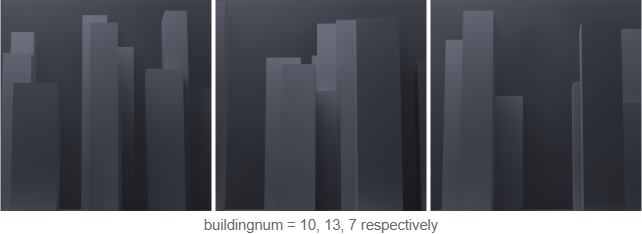

# citygenerator
### a user-input based city generator for blender

introduction to python scripting in blender. my script aims to create a randomly generated city skyline based on the user's desired number of buildings.

### results:

### improvements for the future:

turn into proper add-on, with a panel in the layout tab of blender

ability to customize base size

simple material customizer

seed randomization
